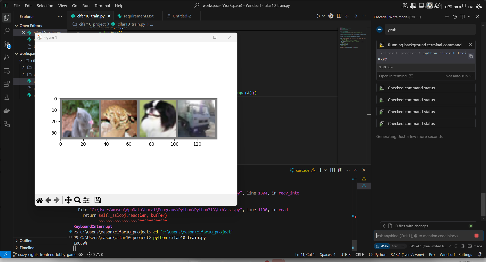
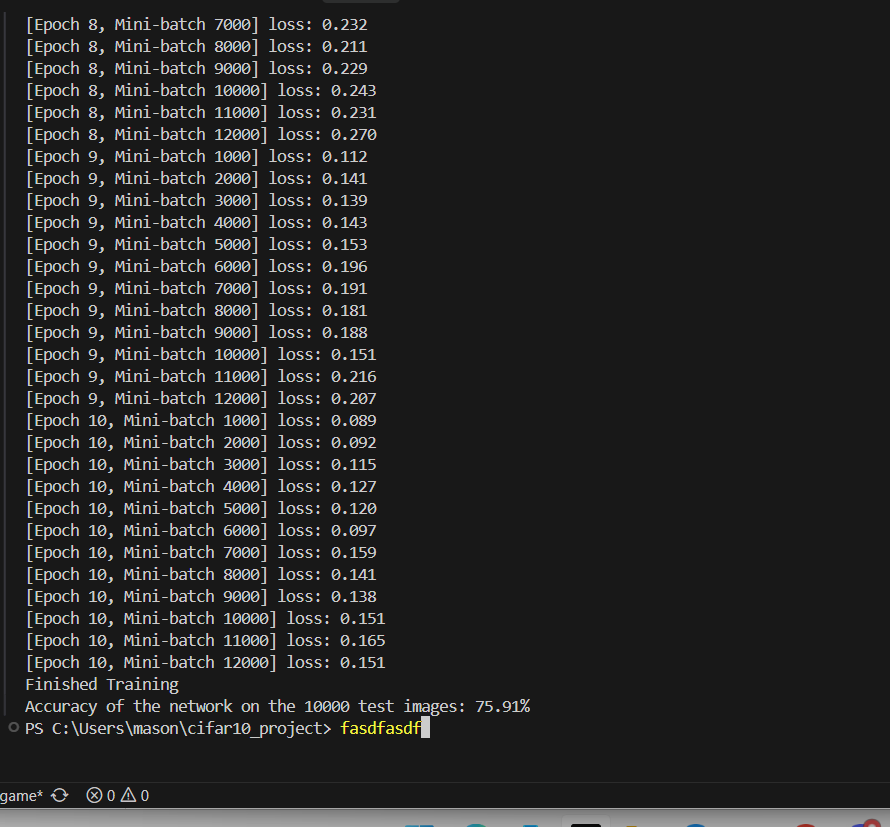
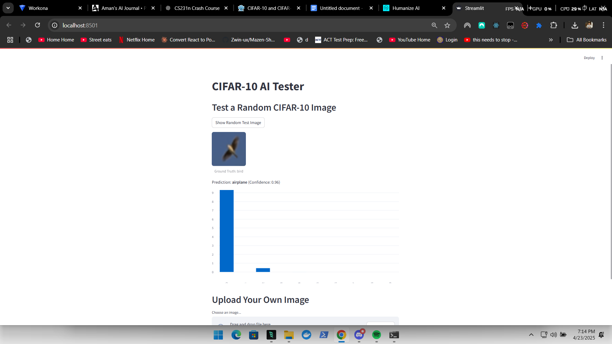

# Results

After training, you'll see printed metrics per epoch and final test accuracy.

- Best validation accuracy is tracked and saved
- Final test accuracy uses the best checkpoint
- Loss/accuracy curves are plotted at the end of training

Tip: If you run on CPU, expect slower training and lower throughput. For best results, train on a GPU.

## Example classes
CIFAR-10 classes: airplane, automobile, bird, cat, deer, dog, frog, horse, ship, truck.

## Training Curves

Below are the loss and accuracy curves saved automatically to `docs/assets/training_curves.png` after training:

## Sample Screenshots

Example images from the project (moved into `docs/assets/`):

